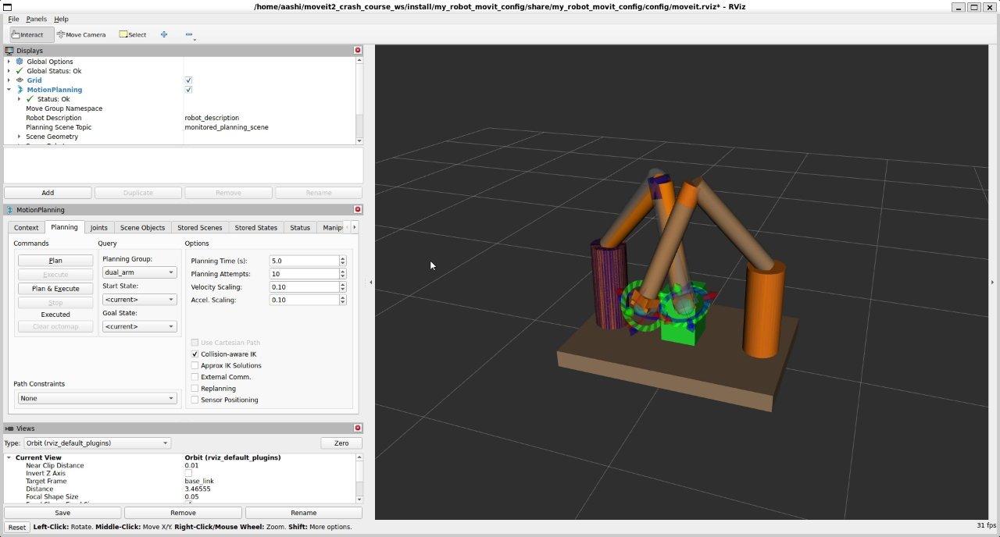

# MoveIt 2 — Dual Arm Motion Planning

ROS 2 workspace with a custom dual-arm robot URDF, MoveIt 2 planning groups, and collision-aware trajectory execution in RViz.

## Demo

[](https://github.com/AashishH15/ros2-moveit2-dual-arm/blob/main/demo/dual-arm-moveit.mp4)

*Click the image above to open the full video.*

Also on [portfolio](https://aashishharishchandre.netlify.app/).

## What this is

- Custom dual-arm URDF built from Xacro macros (left + right 6-DOF arms on a shared base)
- MoveIt 2 config with `left_arm`, `right_arm`, and `dual_arm` planning groups
- Collision geometry including a fixed obstacle box on the base
- ros2_control mock hardware with per-arm `JointTrajectoryController`s
- `plan_animator.py` — replays planned trajectories to `joint_states` for smooth RViz visualization

## What this is NOT

This repo contains **only my robot packages** (~30 source files). It does **not** include:

- ROS 2 itself (install separately from [ROS 2 docs](https://docs.ros.org/))
- MoveIt 2 source (install via `apt` or build from source)
- `ros2_controllers` or other upstream ROS packages (install via `apt`)
- Colcon `build/`, `install/`, or `log/` artifacts

You need a local ROS 2 + MoveIt 2 install to run this.

## Requirements

- [ROS 2](https://docs.ros.org/) Jazzy or Humble (tested on Jazzy)
- MoveIt 2 (`ros-jazzy-moveit` or equivalent)
- ros2_control + controllers (`ros-jazzy-ros2-control`, `ros-jazzy-joint-trajectory-controller`, `ros-jazzy-joint-state-broadcaster`)
- `colcon` build tools

## Run

1. Create a colcon workspace and clone this repo into `src/`:

```bash
mkdir -p ~/moveit2_ws/src
cd ~/moveit2_ws/src
git clone https://github.com/AashishH15/ros2-moveit2-dual-arm.git
```

2. Install dependencies and build:

```bash
cd ~/moveit2_ws
rosdep install --from-paths src --ignore-src -r -y
colcon build --symlink-install
source install/setup.bash
```

3. Launch MoveIt with ros2_control (full demo):

```bash
ros2 launch my_robot_movit_config demo.launch.py
```

4. Or launch with the lightweight plan animator (no ros2_control):

```bash
ros2 launch my_robot_movit_config demo_jsp.launch.py
```

In RViz, use the **MotionPlanning** panel to plan and execute paths for `left_arm`, `right_arm`, or `dual_arm`.

## Pipeline (high level)

1. Spawn dual-arm robot + obstacle in RViz via `robot_state_publisher`
2. MoveIt `move_group` plans collision-free joint trajectories per arm
3. Trajectories stream to ros2_control mock hardware (or `plan_animator` for visualization-only)
4. Both arms coordinate around the shared base obstacle without self-collision

## Learning path

Built while following Articulated Robotics' [MoveIt 2 Crash Course](https://articulatedrobotics.xyz/courses/moveit2-crash-course/), extended with dual-arm SRDF groups, per-arm controllers, obstacle collision tuning, and a custom trajectory animator.

## Author

**Aashish Harishchandre's** [Portfolio](https://aashishharishchandre.netlify.app/) · MSU Computer Science
